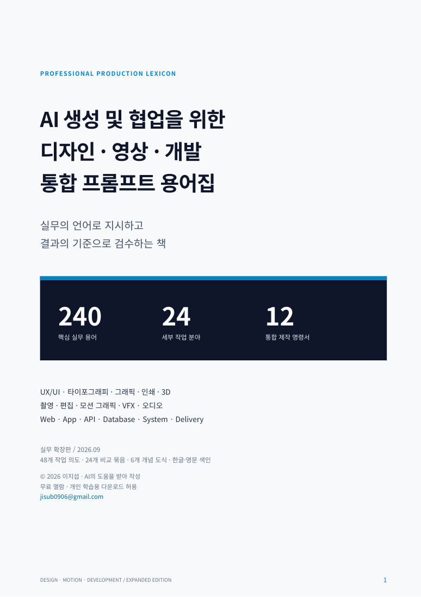

# AI 프롬프트 용어집: 디자인·영상·개발 실무 용어 240개

**AI Prompt Glossary · Design, Video & Development**

**“원하는 건 알겠는데, AI에게 뭐라고 지시해야 할까?”**

UX/UI 디자인, 그래픽·3D, 영상 편집·모션 그래픽, 웹·앱 개발에서 쓰는 **240개 실무 용어**를 정리한 한국어 AI 프롬프트 용어 사전입니다. **정의 → 구체적인 명령 → 결과 검수 → 수정 요청**으로 연결하며, 무료 열람용 203쪽 PDF와 웹 용어집을 제공합니다.

**[실무 용어 240개 웹에서 읽기](glossary/README.md)** · **[무료 PDF 용어집 열람](book/AI_Integrated_Prompt_Glossary_KO.pdf)** · **[PDF 바로 다운로드](https://github.com/jisub-lee-0906/ai_integrated_prompt_glossary/raw/refs/heads/main/book/AI_Integrated_Prompt_Glossary_KO.pdf)** · **[English](README.en.md)**

> A practical vocabulary reference for precise AI instructions in UX/UI, graphics, 3D, video, motion design, web development and systems. Korean reference with English terminology and a separate [English quick-start guide](docs/QUICKSTART.en.md).

| 실무 용어 | 작업 분야 | PDF | 제작 명령서 |
| :---: | :---: | :---: | :---: |
| **240개** | **24개 장** | **203쪽** | **12개** |

## 30초 만에 살펴보기

| 막히는 요청 | 필요한 용어 | 구체적으로 지시하기 |
| --- | --- | --- |
| “글자 간격 좀 고쳐 줘” | [Kerning · 커닝](glossary/D3.md#d3-02) | AV 글자 쌍의 간격만 보정하고 전체 트래킹은 유지하라. |
| “카메라가 제품에 다가오게” | [Dolly In · 달리 인](glossary/V1.md#v1-03) | 제품 형태를 유지하고 카메라를 전진시켜 배경 시차가 변하게 하라. |
| “투명 배경으로 줘” | [Alpha Channel · 알파 채널](glossary/D5.md#d5-07) | 실제 알파가 있는 PNG를 납품하고 밝은·어두운 배경에 합성해 검수하라. |
| “예약이 중복되지 않게” | [Idempotency · 멱등성](glossary/S2.md#s2-06) | 동일 키 재시도는 기존 결과를 반환하고 동시 요청의 중복 생성을 막아라. |

## 내 작업에서 시작하기

- **이름을 몰라도 찾기:** [48개 작업 의도에서 용어 찾기](glossary/TASK_FINDER.md)
- **디자인·UX/UI·3D:** [레이아웃·디자인 시스템](glossary/D2.md) · [타이포그래피](glossary/D3.md) · [투영·카메라](glossary/D7.md) · [메시·재질](glossary/D8.md)
- **영상·모션·VFX:** [카메라 움직임](glossary/V1.md) · [편집](glossary/V2.md) · [모션 제어](glossary/V3.md) · [코덱·납품](glossary/V5.md)
- **개발·시스템:** [API 계약](glossary/S2.md) · [데이터베이스](glossary/S3.md) · [동시성·장애 처리](glossary/S7.md) · [빌드·배포](glossary/S8.md)
- **완성된 요청문부터 보기:** [실무 제작 명령서 12개](examples/README.md) · [English copy-ready examples](docs/QUICKSTART.en.md)

**[240개 전체 용어 보기](glossary/README.md)** · [영문 용어 A–Z 색인](glossary/ENGLISH_INDEX.md) · [PDF 상세 목차와 쪽수](CONTENTS.md) · [자주 묻는 질문](docs/FAQ.md)

## 용어 하나에 담긴 것

각 항목은 한글명·영문명과 다음 여섯 가지 내용을 제공합니다.

| 구성 | 답하는 질문 |
| --- | --- |
| 뜻·쓰임 | 무엇이며 언제 필요한가? |
| 혼동 구분 | 비슷한 개념과 무엇이 다른가? |
| 실행 명령 | AI에게 어떤 대상과 행동을 지정할까? |
| 설정·계약 | 단위·수치·버전·입출력을 어떻게 정할까? |
| 검수 | 실제 파일과 동작에서 무엇을 확인할까? |
| 수정 명령 | 결과가 어긋났을 때 무엇을 바꿀까? |

## 책의 범위

| 분야 | 수록 내용 | 항목 |
| --- | --- | ---: |
| 디자인·비주얼 | UX/UI, 타이포그래피, 그래픽, 인쇄, 조명, 투영, 3D | 80 |
| 영상·모션·오디오 | 촬영, 편집, 애니메이션, VFX, 색관리, 코덱, 오디오·자막 | 60 |
| 개발·시스템 | 프런트엔드, API, DB, 설계, 테스트, 보안, 동시성, 배포 | 80 |
| 제작 인계·AI 제어 | 자산 명세, 인수 기준, 생성 제어와 반복 수정 | 20 |

PDF 부록에는 **혼동 용어 비교 24묶음, 개념 도식 6개, 제작 명령서 12개, 필수 약어 48개, 공식 참고자료 48개, 한글·영문 색인**이 있습니다. 관련 개념을 함께 비교한 항목은 하나로 계산하며, 약어는 핵심 240개와 별도입니다.

책 표지 보기

## 이런 분에게 유용합니다

- AI로 시안을 만들고 정확하게 수정하고 싶은 디자이너
- 카메라·편집·모션·납품 조건을 명확히 지시하려는 영상 제작자
- AI 코딩 도구에 구조·오류 처리·검수 기준을 전달하려는 개발자
- 여러 분야의 결과물을 연결하고 검토하는 기획자와 교육자

Midjourney, Stable Diffusion, Runway, ChatGPT, Claude 등의 작업을 설명할 때 참고할 수 있습니다. 도구별 지원 기능과 실제 파일 속성은 별도로 확인해야 합니다. 모든 예시를 모든 모델에서 실행해 검증한 것은 아닙니다.

## 오류 제보와 개선 참여

용어가 부정확하거나 설명이 부족한가요? **[오류 제보](https://github.com/jisub-lee-0906/ai_integrated_prompt_glossary/issues/new?template=correction.yml)** 또는 **[새 용어 제안](https://github.com/jisub-lee-0906/ai_integrated_prompt_glossary/issues/new?template=term_request.yml)**을 남겨 주세요. 항목 번호·문제·근거가 있으면 수정 방향을 찾기 쉽습니다.

작은 오탈자나 링크 수정도 환영합니다. [기여 안내](CONTRIBUTING.md)를 확인하세요. 한국어와 영어로 의견을 받을 수 있습니다.

## 저작권·AI 활용

**© 2026 이지섭 · [jisub0906@gmail.com](mailto:jisub0906@gmail.com)**

**AI의 도움을 받아 작성**했습니다. 무료 열람, 개인 학습용 다운로드, 원본 링크 공유와 본인의 학습·실무에서 짧은 명령 예시 활용을 허용합니다. 문서의 재배포·수정본 배포·판매·교재 수록 등은 사전 문의해 주세요. [전체 이용 조건](LICENSE.md) · [AI 활용 공개](AI_USAGE.md)

**이 책이 작업에 도움이 됐다면 Star로 저장하고, 필요한 동료에게 원본 링크를 공유해 주세요.**
